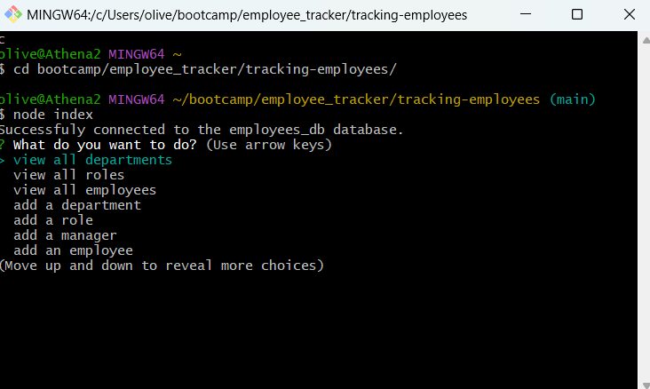

  
  # Who Works Here?

  ## Table of Contents
  * [Description](#description)
  * [Installation](#installation)
  * [Usage](#usage)
  * [Tests](#tests)
  * [Contributors](#contributors)
  * [Email](#email)
  * [Github](#github)
  * [License](#license)

  ## Description
  A MySQL based application for adding and viewing employees, departments and roles in a company. 

  
  
  

  ## Installation
  Click the link to view the GitHub repository, then clone the files into a local repository. After which you can run npm i to install the necessary packages, run your MySQL database, then using your terminal (as shown in the video) select the action you would like from the list and follow provided instructions. 

  ## Usage
  Using the terminal (as shown in the video linked below) select the action you would like from the list and follow the provided instructions. 

  ## Tests
  N/A

  ## Contributors
  Oliver Terry-Morales, TA Kayvon Kazemini

  ## Email
  If you have any questions, please don't hesitate to reach me via email at oliverwills0227@gmail.com

  ## GitHub
  https://www.github.com/otmorales23

  
  ## License 
    This project is licensed with MIT

